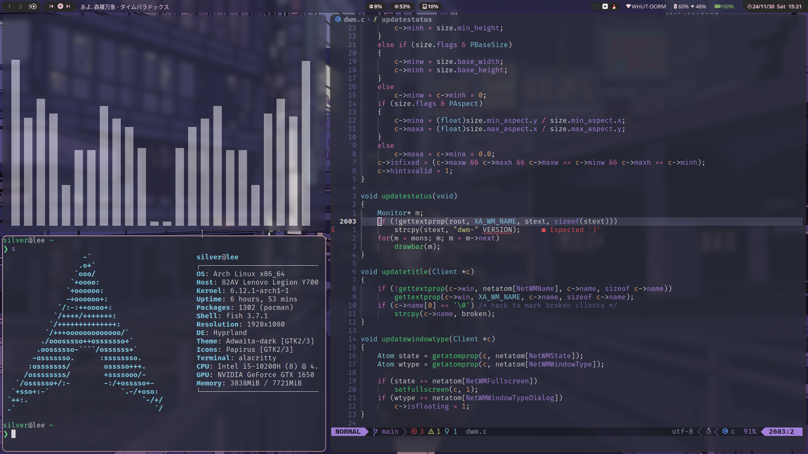
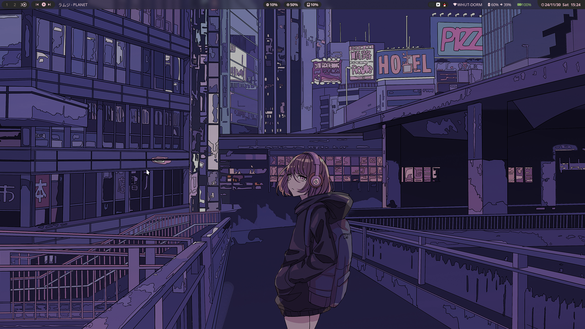

**Window Manager** : hyprland

**Shell** : fish

**Keybord-layont** : Colemak

**Terminal** : Alacritty

**Notify Daemon** : Dunst

**Launcher** : Rofi

**File Manager** : Yazi

## 🌸 Setup

<summary><b>OLD SETUP</b></summary>






### Install steps (Take care about it. Isn't a tutorial)


[Read Spanish Detailed Guide Here](https://aprendiendoaprogramar.netlify.app/configurando-hyprland-y-wayland/)

<summary><b>LONG READ DISCLAIMER</b></summary>

## INSTALLATION (Arch Based Only)

##### First of all, this is a cute disclaimer. All of this settings are installed in Artix and in wayland only! I don't know how it work in other distro.

<div align="left">

<summary><h3>Hyprland Stuff</h3></summary>

###### To get started, let's make sure we have all the necessary prerequisites. In this case, I'm using Paru as the AUR helper, but keep in mind that your system may require a different approach.

- Installation using paru

```sh
## Hyprland Stuff
paru -S hyprland-git hyprpicker-git waybar-git \
dunst nwg-look wf-recorder wlogout wlsunset
```


<summary><h3>Dependencies</h3></summary>

- Installation using paru

```sh
## Dependencies
paru -S colord ffmpegthumbnailer gnome-keyring grimblast-git gtk-engine-murrine \
imagemagick kvantum pamixer playerctl polkit-kde-agent qt5-quickcontrols        \
qt5-quickcontrols2 qt5-wayland qt6-wayland swww ttf-font-awesome tumbler     \
ttf-jetbrains-mono ttf-icomoon-feather xdg-desktop-portal-hyprland-git xdotool  \
xwaylandvideobridge-cursor-mode-2-git cliphist qt5-imageformats qt5ct
```

- Plagin: hyprsplit

```sh
hyprpm update
hyprpm add https://github.com/Duckonaut/hyprsplit # Add the plugin repository
hyprpm enable hyprsplit # Enable the plugin
hyprpm reload # Reload the plugins
```


<summary><h3>Apps & More</h3></summary>

```sh
## CLI & Tools
paru -S btop cava fastfetch noise-suppression-for-voice   \
rofi-lbonn-wayland-git rofi-emoji starship zsh viewnior ocs-url
```

```sh
## Browser & File Explorer
paru -S brave-bin file-roller noto-fonts noto-fonts-cjk  \
noto-fonts-emoji nautilus
```

```sh
# Theme Based
paru -S catppuccin-gtk-theme-macchiato catppuccin-gtk-theme-mocha papirus-icon-theme sddm-git swaylock-effects-git kvantum kvantum-theme-catppuccin-git
```

```sh
# Pipewire & OBS
paru -S obs-studio-rc ffmpeg-obs cef-minimal-obs-rc-bin   \
pipewire pipewire-alsa pipewire-audio pipewire-pulse      \
pipewire-jack wireplumber gst-plugin-pipewire pavucontrol
```


</div>

<summary><h3>DOTFILES</h3></summary>

use GNU_stow to stow dotfiles, or move to the right place manually


</div>

## Credits

_Beauty community: [r/unixporn](https://www.reddit.com/r/unixporn)._

**©** _Artist who make Wallpapers, graphics and more_

**©** _All of mantainers of this amazing and opensource tools :3_

---

© [Owl4ce](https://github.com/owl4ce) © [Ilham25](https://github.com/ilham25) ©
[Siduck](https://github.com/siduck) © [NvChad](https://github.com/NvChad) ©
[Rxyhn](https://github.com/rxyhn) © [AmitGold](https://github.com/AmitGolden)
